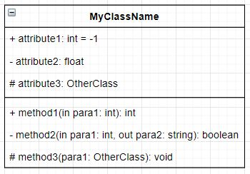

# UML

Unified Modeling Language (UML) is a standard language for specifying, visualizing, constructuing, and documenting the artifacts of software systems.

Structural Modeling:
* Class Diagram
* Object Diagram
* Deployment Diagram
* Pacakge Diagram
* ...

UML **Class Diagram** describes the attributes and operations/methods of a class and also the constraints imposed on the system. It is widely used in the modeling of object-oriented systems.

## UML Class Notation

### Class Visibility

* public: `+`
* private: `-`
* protected: `#`
* package: `~`, instances of other classes within the same package

### Parameter Direction

Each parameter in a method may be denoted as `in`, `out` or `inout` to specify its direction with respect to the caller.

### Relationships between Classes

* Inheritance: a solid line with a hollow arrowhead that points from the child to parent