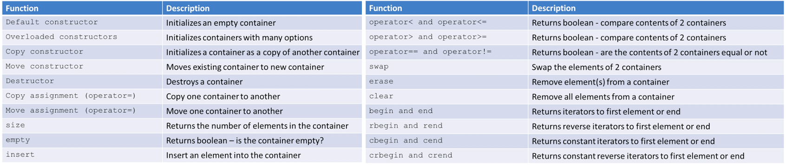
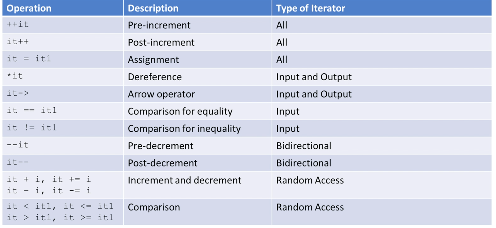

# C++ Standard Template Library (STL)

STL is a set of C++ template classes to provide common data structures and functions.

Four STL components:
- Algorithms
- Containers
- Iterators
- Functions

In terms of usages:
+ [Numeric Functions](./numeric-functions.md)
+ [Text Processing](./text-processing.md)
+ [I/O and Filesystem](./io-filesystem.md)
+ [Multithreading](./multithreading.md)
+ [Type Traits](./type-traits.md)
+ [Time](./time.md)
+ [Smart Pointer](../pointers/README.md)

## 1. Algorithms

The header `<algorithm>` defines many commonly used algorithms for processing sequences of elements from containers, e.g. `find`, `max`, `sort`, `accumulate`, `count`, etc.

Many algorithms requires extra information in order to do their work. For example, to use `find()` on a custom class object, that class must have `operator==` defined.
- Functors (function objects)
- Function pointers
- **Lambda expressions** (introduced by C++11) <- recommended

A complete list of common and useful algorithms can be found at [https://en.cppreference.com/w/cpp/algorithm](https://en.cppreference.com/w/cpp/algorithm).

### Non-modifying

```c++
/* for_each() applies a unary function to each element */
std::vector<int> nums = {1,2,3};
// Functor
struct Print_Functor {
    void operator() (const int& n) {
        std::cout << n;
    }
};
Print_Functor print; // function object
// Function pointer
void print(const int& n) {
    std::cout << n;
}
// Lambda expression
auto print = [](const int& n) {std::cout << n;};
std::for_each(nums.begin(), nums.end(), print);

/* find() the 1st element in the container */
/* return an iterator pointing to the located element or end() */
auto it = std::find(nums.begin(), nums.end(), 2);   // if found 2, it!=nums.ends()
/* find_if(), find_first_of(), adjacent_find() */

/* search() the 1st occurrence of the sequence of elements */
std::vector<int> v1 = {9,1,2,3,4,1,1};
auto it = std::search(v1.begin(), v1.end(), nums.begin(), nums.end());
if (it != v1.end()) {
    std::cout << "nums[] is presented at index " << std::distance(v1.begin(), it) << std::endl;
}

/* min_element(), max_element() return the iterator of min/max element */
std::vector<int>::iterator it = std::min_element(v1.begin(), v1.end());
/* min(), max(), minmax() return the values directly, lambda function enabled */
int intMin = std::min(-10, -5, [](int a, int b) { return std::abs(a) < std::abs(b); }); // -5
std::pair<int, int> pairint = std::minmax({3, 12, -1, -10}); // -10. 12

/* count() the number of specific element */
std::vector<int>::iterator it = std::count(v1.begin(), v1.end(), 1);
/* count_if() */

/* std::all_of, std::any_of, std::none_of return condition over a range of elements */
std::vector<int> v2 {1, 2, 3, 4, 5, 6, 7, 8, 9};
std::any_of(v2.begin(), v2.end(), [](int i){return i%2;}); // true

/* forward() enables to write function templates where the arguments are identically forwarded */
template <typename T, typename... Args>
    T createT(Args&&... args) {
        return T(std::forward<Args>(args)...);
    }
struct MyData {
    MyData(int, double, char){};
};
MyData myData1 = createT<MyData>(1, 2.3, 'a');

/* std::equal() checks if both ranges are equal */
std::string str1{"Only For Testing Purpose."};
std::string str2{"Only For Testing purpose."}
std::equal(str1.begin(), str1.end(), str2.begin()); // false
std::equal(str1.begin(), str1.end(),
            str2.begin(),
            [](char c1, char c2){return std::toupper(c1) == std::toupper(c2);}); // true

/* std::lexicographical_compare() checks if first range is smaller than the second */

/* std::mismatch() finds the first position at which both ranges are not equal */
auto itr_pair = std::mismatch(str1.begin(), str1.end(), str2.begin());
// if str1 == str2, then itr_pair.first == str1.end()
*itr_pair.first;    // P
*itr_pair.second;   // p
```

#### Reference Wrappers

Reference wrapper is a *copy-constructible* and *copy-assignable* wrapper for an object of type `&`.

```c++
template <typename T>
    void doubleMe(T t) {
        t *= 2;
}
int a = 1;
doubleMe(a); // a = 1
/* std::ref creates a non constant reference wrapper */
doubleMe(std::ref(a)); // a = 2


void invokeMe(const std::string& s){
  std::cout << s << ": const " << std::endl;
}
std::string s{"string"};
/* std::cref creates a constant reference wrapper */
invokeMe(std::cref(s));


/* std::reference_wrapper creates a reference object */
void foo() {
  std::cout << "foo invoked" << std::endl;
}
typedef void callableUnit();
std::reference_wrapper<callableUnit> refWrap(foo);
refWrap(); // foo invoked

int a = 2;
std::reference_wrapper<int> myInt(a);
std::cout << myInt << " " << myInt.get() << std::endl; // 2 2
```

### Modifying

```c++
/* copy() a range of elements to another range */
std::copy(src_vector.begin(), src_vector.end(), dest_vector.begin());

/* replace() elements in a range */
std::string str {"only for test"};
std::replace(str.begin(), str.end(), ' ', '1'); // only1for1test
str::string str2;
std::replace_copy_if(str.begin(), str.end(), std::back_inserter(str2), [](char c){return c == '1';}, '2'); // str2=only2for2test

/* remove() a range of elements */
std::vector<int> v {0, 1, 2, 3, 4, 5, 6, 7, 8, 9,10};
auto fwdIt = std::remove_if(v.begin(), v.end(), [](int a){return a%2;});
v.erase(fwdIt, v.end()); // 0,2,4,6,8,10
/* or, a compact way */
// v.erase(std::remove_if(v.begin(), v.end(), [](int a){return a%2;}), v.end());

/* fill() a range of elements with specific value */
std::fill(v.begin(), v.end(), -1);
/* generate() a range of elements */
int genNext() {
    static int next {0};
    return ++next;
}
std::vector<int> v(8, 0);
std::generate_n(v.begin(), 5, genNext); // 1,2,3,4,5,8,8,8

/* move() a range of elements to destination */
std::vector<int> src {0,1,2,3,4,5,6,7};
std::vector<int> des(10);
std::move(src.begin(), src.end(), des.begin());
// src remains the same
// des = 0,1,2,3,4,5,6,7,0,0

/* transform() applies a unary/binary callable to a range and copies the modified to destination */
std::string str {"abcd"};
std::transform(str.begin(), str.end(), str.begin(), [](char c){ return std::toupper(c); }); // ABCD

/* rotate() makes the picked element as the new first element */
std::string str {"12345"};
std::rotate(str.begin(), str.begin()+2, str.end()); // 3,4,5,1,2

/* shuffle() */
std::vector<int> v {0, 1, 2, 3, 4, 5, 6, 7, 8, 9};
unsigned seed = std::chrono::system_clock::now().time_since_epoch().count();
std::shuffle(v.begin(), v.end(), std::default_random_engine(seed));

/* unique() removes the duplicates */
std::vector<int> v {0, 0, 2, 3, 4, 0};
v.erase(std::unique(v.begin(), v.end()), v.end()); // 0,2,3,4

/* reverse() elements in a range */
std::reverse(v.begin(), v.end());

/* swap() interchanges the values of two elements */
std::swap(a, b);

/* move() efficiently transfers the resource to another object.
 * thread/lock object cannot be copied, only be moved.
 * move operation leaves the moved-from object valid but with unspecified value.
 * after moved, the moved-from object should be destroyed or assigned a new value.
 */
std::string str = "hello";
std::vector<string> v;
v.push_back(str);               // copy str to vector
v.push_back(std::move(str));    // content of str is moved to vector, after which str might be empty
/* move() also works for class which defines the move constructor/assignment */
class MyData{
    MyData(MyData&& m) = default; // move constructor
    MyData& operator = (MyData&& m) = default; // move assignment 
    MyData(const MyData& m) = default; // copy constructor
    MyData& operator = (const myData& m) = default; // copy assignment
}

/* partition() decompose a set into subsets */
bool isOdd(int i){ return (i%2); }
std::vector<int> vec{1, 4, 3, 8, 5, 6};
auto parPoint_it = std::partition(vec.begin(), vec.end(), isOdd);
// 1,3,5,4,8,6, and parPoint_it points to 4

/* make_heap() creates a heap */
std::vector<int> vec{4, 3, 2, 1, 5, 6, 7, 9, 10};
std::make_heap(vec.begin(), vec.end()); // 10,9,7,4,5,6,2,3,1
vec.push_back(100); // 10,9,7,4,5,6,2,3,1,100
std::is_heap_until(vec.begin(), vec.end()); // itr points to 100
std::push_heap(vec.begin(), vec.end()); // 100 10 7 4 9 6 2 3 1 5
std::pop_heap(vec.begin(), vec.end());  // 10 9 7 4 5 6 2 3 1 100
vec.resize(vec.size() - 1); // 10,9,7,4,5,6,2,3,1

/* next_permutation(), prev_permutation() return the next bigger or previous smaller permutation of the newly ordered range */

/* numeric operations: accumulate(), adjacent_difference(), inner_product(), partial_sum(), etc. */
```

### Sorting and Searching

```c++
/* sort() uses default operator < */
std::sort(v.begin(), v.end());
std::sort(v.begin(), v.end(), greater<int>());   // use operator >, descending order

/* binary_search() finds the matching value after sort() */
bool found = std::binary_search(v.begin(), v.end(), val);

/* merge() combines two sorted ranges into one sorted range */
std::merge(v1.begin(), v1.end(), v2.begin(), v2.begin(), dst.begin());
std::merge(v1.begin(), v1.end(), v2.begin(), v2.begin(), back_inserter(dst));
```

## 2. Containers

*Containers* or *container classes* store objects and data. Collections of objects or primitive types, e.g. `array`, `vector`, `deque`, `set`, `map`, etc. 

Containers used in programming: dynamic arrays (vector), queues (queue), stacks (stack), heaps (priority_queue), linked lists (list), trees (set), associative arrays (map)...

- Sequence containers
    * array, vector, list, forward_list, deque
- Associative containers
    * set, multiset, map, multimap
- Unordered associative containers
    * unordered_set, unordered_multiset, unordered_map, unordered_multimap
- Container adaptors
    * stack, queue, priority_queue

Each container has member functions: some are specific to the container, others are available to all containers (see below).


> Q: What type of elements can be stored in containers?
> - A copy of the element will be stored in the container
> - Element should be copyable (copy constructor), assignable (copy assignment), and moveable (move constructor, move assignment)
> - ordered associative containers must be able to compare elements (operator<, operator==)

#### `pair`

```c++
std::pair<int, char> p1 = std::make_pair(1, 'a');
std::pair<int, pair<int, char>> p2 = {1, {2, 'b'}};
std::cout << p1.first << p1.second << std::endl;  // 1, a
std::cout << std::get<0>(p1) << std::get<1>(p1) << std::endl; // 1, a
std::cout << p2.second.second << std::endl;       // b
```

#### `tuple`

`std::tuple` is an object that can hold a number of elements. `std::tie` creates a tuple with reference variables. `std::ignore` can explicitly ignore elements of the tuple.

```c++
std::tuple<char, int, float> t;
t = std::make_tuple('a', 29, 1.78);

std::cout << get<0>(t) << std::endl;    // access the 1st element
std::get<2>(t) = 1.86;                  // modify the 3rd element

char c_val = 'z';
int i_val = 0;
float f_val = 0.0;
std::tie(c_val, i_val, f_val) = t;                  // unpack tuple values into separate variables
std::cout << c_val << i_val << f_val << std::endl;  // a, 29, 1.86
std::tie(c_val, std::ignore, f_val) = t;            // ignore the 2nd element
```

### Sequence Containers

#### `array`

`std::array` has a **fixed size**, is able to random access the element at a constant time. It provides access to the underlying raw array. Use the `std::array` object whenever possible instead of using raw arrays. All iterators are available and they won't invalidate.

```c++
std::array<int, 5> arr1 {1, 2, 3, 4, 5};
std::array<int, 5> arr2 {}; // init to 0 by default

arr1.empty();       // false (0)
arr1.size();        // 5

arr1.at(0);         // 1, has boundary check
arr1[0];            // 1, no boundary check
std::get<0>(arr1);
arr1.front();       // 1
arr1.back();        // 5

arr1.fill(10);      // fill all to 10
arr2.swap(arr1);    // swap two arrays
int *ptr = arr1.data(); // get the address to the raw array
```

#### `vector`

`std::vector` likes an array but has a **dynamic size**, and elements are stored in the contiguous memory space. It has constant time of random access to element, constant time insertion/deletion at the back, linear time of insertion/removal of any element. All iterators are available but may invalidate when resizing.

+ Initialization

```c++
std::vector<int> vec1 {1,2,3,4,5};
std::vector<int> vec2 = {1,2,3,4,5};
std::vector<int> vec3(N, 0); // init a vector with N elements of 0
std::vector<int> vec4(vec3.begin(), vec3.end());
std::vector<int> vec5(vec4);
std::vector<int> vec6 = vec5;
std::vector<int> vec7(std::move(vec6));
std::vector<int> vec8 = std::move(vec7);
std::vector<std::vector<int>> matrix(N, std::vector<int>(M, 0)); // init NxM matrix filled with all 0
```

+ Common operations

```c++
std::vector<int> vec1 {1,2,3,4,5};
/* Size */
vec1.size();        // number of elements, 5
vec1.capacity();    // the actual memory space allocated that may larger than size, 5
vec1.max_size();    // max size that system allows a vector to have

vec1.push_back(6);  // add 6 to the back
vec1.capacity();    // system may allocate more space than required, let's say 10
vec1.reserve(40);   // reserve additional space for vector, now capacity() == 50
vec1.shrink_to_fit();   // this force size() == capacity(), now capacity() == 6
vec1.resize(7);     // increase size to 7 elements, and filled with 0s

/* Indexing */
vec1.at(0);         // boundary check, 1
vec1[6] = 7;        // no boundary check
vec1.front();       // 1
vec1.back();        // 7

/* Modification */
vec1.push_back(8);  // add 8 to the back
vec1.pop_back();    // remove the last element

vec1.erase(vec1.begin(), vec1.begin()+2);   // 4,5
vec1.clear();       // remove all
```

+ Common methods

```c++
std::vector<int> vec3{1,2,7,8};
std::vector<int> vec4{4,5,6};
auto it = std::find(vec3.begin(), vec3.end(), 7);   // get iterator
vec3.insert(it, 3); // 1,2,3,7,8
std::insert(it, vec4.begin(), vec4.end()); // 1,2,3,4,5,6,7,8
for (auto v: vec4) std::cout << v << " ";

std::vector<int> vec5{1,2,3,4};
std::vector<int> vec6{5,6};
std::copy(vec6.begin(), vec6.end(), std::back_inserter(vec5)); // vec5 == {1,2,3,4,5,6}

std::vector<int> vec7{1,2,3,4};
std::vector<int> vec8{0};
std::copy_if(vec7.begin(), vec7.end(), std::back_inserter(vec8), [](int x){ return x%2 == 0; }); // vec8 == {0,2,4}

std::vector<int> vec9{1,2,3};
std::vector<int> vec10{1,2,3};
std::vector<int> vec11;
std::transform(vec9.begin(), vec9.end(), vec10.begin(), std::back_inserter(vec11), [](int x, int y){ return x*y; }); // vec11 == {1,4,9}
```

> Q: `push_back(MyClass{argu1, argu2})` vs. `emplace_back(argu1, argu2)`?
> Difference 1 input argument: when vector type is a user-defined type with multiple arguments for constructor, `push_back()` requires we pass an object of that type to it. But we can simply pass the arguments of the constructor directly to `emplace_back()`.
> Difference 2 efficiency: for built-in types, two methods have no difference. But for user-defined types, `push_back()` requires a temporary object to be created and destroyed while `emplace_back()` avoids using the temporary object.

#### `deque`

`std::deque` likes a vector but its elements are NOT stored in contiguous memory. The underlying implementation is like a linked-list vectors so it supports constant time of insertion/deletion at the front as well at back. Other characteristics are similar to vector.

Common methods:
+ `push_back()`, `pop_back()`, `push_front()`, `pop_front()`
+ `emplace_back()`, `emplace_front()`
+ `assign()`

```c++
class MyInt {
private:
  int myInt;
public:
  MyInt(int i): myInt(i) {};
  friend ostream& operator << (ostream& os, const MyInt& m) {
    os << m.myInt <<" ";
    return os ;
  }
};

std::deque<MyInt> dq;
dq.push_back(MyInt(5));
dq.emplace_back(1);     // element will be passed to the constructor: MyInt(5), MyInt(1)
dq.assign({2, 3, 4});   // assign new content, replace the old, modify the size: 2, 3, 4
```

#### `list`

STL implement the *list* as a *doubly linked list* with dynamic size. Random element access is NOT provided. Insertion and deletion of elements anywhere in the container is constant time. All iterators are available but they invalidate when corresponding element is deleted (though iterator remains to work without error).

Common methods:
+ `push_back()`, `pop_back()`, `push_front()`, `pop_front()`, `emplace_back()`, `emplace_front()`

Special methods:
+ `l1.merge(l2)`, `l1.merge(l2, op)`: merge sorted `l2` into the sorted `l1`, `op` is the sorting criteria
+ `l.remove(val)`, `l.remove_if(pre)`: remove all elements with value `val`, or fulfilling the predicate `pre`
+ `l1.splice(pos, l2)`: split the elements in `l1` before `pos`, and insert `l2`
+ `l.unique()`: remove adjacent element with the same value, better used after `sort()`
+ `l.unique(pre)`: remove adjacent element fulfilling the predicate `pre`

```c++
std::list<int> l1{1,2,3,4,5};
std::list<int> l2(10,0);
l1.size();          // 5
l1.max_size();      // a very large number
l1.front();         // 1
l1.back();          // 5

auto it1 = std::find(l1.begin(), l1.end(), 3);
l1.insert(it1, 10);         // insert element before the iterator: 1,2,10,3,4,5
l1.erase(it1);              // remove the iterator element: 1,2,10,4,5
l1.resize(2);               // remove the elements exceeding the size: 1,2
l1.resize(5);               // fill the list with 0: 1,2,0,0,0

std::list<int> list1 {1, 2, 3, 4, 7, 8, 9};
std::list<int> list2 {5, 6};
list1.splice(std::find(list1.begin(), list1.end(), 7), list2); // 1,2,3,4,5,6,7,8,9
```

#### `forward_list`

STL implement the *list* as a *singly linked list* with dynamic size. It has less overhead than a `std::list`. Random element access is NOT provided. Insertion and deletion of elements anywhere in the container is constant time. Reverse iterators are NOT available. All usable iterators invalidate when corresponding element is deleted.

Common methods:
+ `push_front()`, `pop_front()`, `emplace_front()`. No concept of **back**

Special methods:
+ `before_begin()`: return iterator before the head
+ `emplace_after(pos, arg...)`: create an element after `pos` with `arg`
+ `emplace_front(arg...)`: create an element before head ` with `arg`
+ `erase_after(pos, ...)`: remove from `pos`
+ `insert_after(pos, ...)`: insert after `pos`
+ `l.merge(c)`, `l.merge(c, op)`: merge sorted `c` into the sorted `l`, `op` is the sorting criteria
+ `l1.splice_after(pos, l2)`: split the elements in `l1` after `pos`, and insert `l2`
+ `unique()`: remove adjacent element with the same value, better used after `sort()`
+ `unique(pre)`: remove adjacent element fulfilling the predicate `pre`

```c++
std::forward_list<int> l1 {1,2,3,4,5};
auto it1 = std::find(l1.begin(), l1.end(), 3);
l1.insert_after(it1, 10);   // insert element after the iterator: 1,2,3,10,4,5
l1.erase_after(it1);        // remove the element after iterator: 1,2,3,4,5
l1.empty(); // std::forward_list doesn't have a method of size()
```

### Container Adaptors

#### `queue`

*Queue* is FIFO. It it implemented as an adaptor over other STL containers, can be implemented as a `list` or `deque` (default). Elements are pushed at the back and popped from the front. No iterators are supported.

Common methods: `push()`, `pop()`, `front()`, `back()`, `empty()`, `size()`.

```c++
std::queue<int> q; // default implemented as a deque
std::queue<int, std::list<int>> q1;
std::queue<int, std::deque<int>> q2;
```

#### `priority_queue`

*Priority queue* provides a constant time extraction of the largest element at the front and logarithmic insertion. The internal implementation is *binary-max-heap* and as a vector adaptor by default. We cannot iterate on the priority queue, only getting the top element and pop it.

Common methods: `push()`, `pop()`, `top()`, `empty()`, `size()`.

```c++
std::priority_queue<int> pq;
pq.push(1);
pq.top();
pq.pop();
std::priority_queue<int, std::vector<int>, std::greater<int>> pq_min;  // binary-min-heap
```

#### `stack`

*Stack* is LIFO, like a pile of books. It is implemented as an adaptor over other STL containers, can be implemented as a `vector`, `list`, or `deque` (default). All operations occur on the one end of the stack (top). No iterators are supported.

Common methods: `push()`, `pop()`, `top()`, `empty()`, `size()`.

```c++
std::stack<int> s; // default implemented as a deque
s.push(1);
s.pop();
std::stack<int, std::vector<int>> s1;
std::stack<int, std::list<int>> s2;
std::stack<int, std::deque<int>> s3;
```

### Associative Containers

#### `set`

*Set* has no duplicate elements, maintaining the elements sorted internally so it's not necessary to call `sort()` method again and again after adding a new element (thus, access time is logarithmic `O(log(n))`). It's ordered by key, that is for a user-defined class, it must supply with an overloaded `operator<` for comparison. All iterators are available but they invalidate when corresponding element is deleted.

No concept of **front** or **back**.

> `insert()` returns a `std::pair<iterator, bool>`: iterator points to the inserted element or to the duplicate in the set, boolean indicates success or duplicate.

```c++
std::set<int> s1{1,1,1,2,3,4,5};        // 1,2,3,4,5
s1.size();  // 5
ret = s1.insert(1);     // ret=(iterator_to_1, false_because_1_is_dup)

s1.erase(5);            // 1,2,3,4

auto it = s1.find(4);   // 1,2,3
if (it != s1.end())
    s1.erase(it);

std::array<int, 3> arr {4, 7, 9};
s1.insert(arr.begin(), arr.end()); // 1,2,3,4,7,9
s1.erase(s1.lower_bound(5), s1.upper_bound(10)); // 1,2,3,4
s1.count(1);            // easy way to check if 1 exists
s1.clear();             // remove all
s1.empty();             // check if empty

std::multiset<int> s2 {3, 1, 5, 3, 4, 5, 1, 4, 4, 3, 2, 2, 7, 6, 4, 3, 6};
auto pair = s2.equal_range(3); // itr_lower_bound(3), itr_upper_bound(3)
std::distance(pair.first, pair.second); // 4, equivalent to count(3)
```

`multi_set`: sorted by key, allowing duplicates, all iterators are available, access time is `O(log(n))`.
`unordered_set`: unordered elements, no duplicates, elements cannot be modified (must erase and then insert a new one), no reverse iterators, access time is `O(log(k))`.
`unordered_multiset`: unordered elements, allowing duplicates, no reverse iterators, access time is `O(k)`.

#### `map`

A *map* stores elements as key/value pairs, ordered by key, no duplicates because keys are unique. Random access to the element value is available via its key. Internally it is implemented as *Binary Search Tree*. All iterators are available but they invalidate when corresponding element is deleted.

```c++
std::map<int, int, std::greater<int>> m0 = {{1,100}, {2,99}}; // descending order, {2,99}, {1,100}
std::map<int, int> m = {{1,100}, {2,99}}; // default ascending order std::less<int>, {1,100}, {2,99}

/* Three ways of insertion, O(logN) */
m.insert(std::make_pair(3,113));
m.insert(std::pair<int, int>(4,21));
m[5] = 89;

/* Update an element value */
m[5] = 79;
m.at(5) = 69;

/* Remove an element */
m.erase(5);
auto it = m.find(4);
if (it != m.end())
    m.erase(it);

/* Check if 4 exists */
m.count(4);
if (m.find(4) != m.end())
    std::cout << "Found 4!";

m.clear();  // remove all
m.empty();  // check if empty
```

`multi_map`: ordered by key, allowing duplicates, all iterators are available.
`unordered_map`: A *unordered_map* is the same as *map* in terms of the functionalities. But it is implemented as an *array* internally. The **key** will be passed into a **hashing function** and the **index** to the corresponding **value** is calculated. The insertion `O(1)` is faster than *map*'s `O(logN)`. No duplicates, no reverse iterators.
`unordered_multimap`: unordered elements, allowing duplicates, no reverse iterators.

#### Rehashing

For the `unordered_` associative containers, if the number of buckets (capacity) are all filled (`load_factor()==1`), C++ runtime will generate new buckets (**rehashing**) using `rehash()`.

## 3. Iterators

*Iterators* are used for working upon a sequence of elements from containers, e.g. forward, reverse, by value, by reference, constant, etc. *Iterators* work like *pointers* by design, most of the container classes can be traversed with iterators.

1. Iterators must be declared based on the container type that they will iterate over
2. Iterator `.begin()` method points to the **first element**
3. Iterator `.end()` method points to the location **after the last element**



```c++
std::vector<int> vec {1,2,3};
std::vector<int>::iterator it1 = vec.begin();           // declare with container type
for (auto it2 = vec.begin(); it != vec.end(); ++it) {   // declare with auto
    std::cout << *it << " ";
}
std::advance(it1, 2);   // move iterator to the right, or negative value to move to the left
std::prev(it1);         // return iterator before it1
std::next(it1);         // return iterator after it1

/* Inserter */
std::deque<int> dq {5,6,7,10,11,12};
std::vector<int> v {1,2,3,4,5,6,7,8,9,10,11,12,13,14,15};
std::copy(std::find(v.begin(), v.end(), 13),
            v.end(),
            std::back_inserter(dq)); // 5,6,7,10,11,12,13,14,15
std::copy(std::find(v.begin(), v.end(), 8),
            std::find(v.begin(), v.end(), 10),
            std::inserter(dq, std::find(dq.begin(), dq.end(), 10))); // 5,6,7,8,9,10,11,...,15
std::copy(v.rbegin() + 11,
            v.rend(),
            std::front_inserter(dq)); // 1,2,3,4,5,6,...,15

/* Stream Iterators */
std::istream_iterator<int> myIntStreamReader(std::cin);
std::ostream_iterator<int>(std::cout, ":");
```

#### Other iterators

- `const_iterator`: cannot change the values that iterators point to
- `reverse_iterator`: reverse the direction of a regular iterator
- `const_reverse_iterator`

#### Iterator invalidation

Iterator is like a raw pointer that could be invalidated, pointing to junk data. In the following code, no compiler error and no warning will be reported. Developer should watch for such errors and prevent them, e.g. `insert()`, `erase()`, `resize()`.

```c++
for (auto it = map.begin(); it != map.end(); ++it) {
    map.erase(it->first); // map has been restructured and iterator still thinks itself is healthy
}
```

## 4. Functions

The STL includes classes that overload the function call operators. Instances of such classes are *function objects* or *functors*.

#### Callable Units

- functions
- function objects
    + user-defined
    + predefined: `std::less<T>()`, `std::bit_and<T>()`,  `std::logical_and<T>()`, `std::multiplies<T>()`, etc.
- lambda functions

```c++
// Function
void square1(int& i) { i = i * i; }
// Function object
struct square2 {
    void operator()(int& i) { i = i * i; }
};
std::vector<int> v {1,2,3};
std::for_each(v.begin(), v.end(), square1);     // 1,4,9
std::for_each(v.begin(), v.end(), square2());   // 1,16,81
// Lambda function <- preferred
std::for_each(v.begin(), v.end(), [](int& i){i=i*i;}); // 1,256,6561
```

#### `std::bind()` and `std::function()`

```c++
/* bind() enables to create new function objects
 * function() takes these temporary function objects and binds them to a variable
 */
double divideMe(double a, double b) {
    return a/b;
}
// _1 is assigned to a, _2 is assigned to b
std::function<double(double, double)> myDiv1 = std::bind(divideMe, std::placeholders::_1, std::placeholders::_2);
// 20 is assigned to a, _1 is assigned to b
std::function<double(double)> myDiv2 = std::bind(divideMe, 20, std::placeholders::_1);
// divideMe(20, 2) == myDiv1(20, 2) == myDiv2(2)
```
