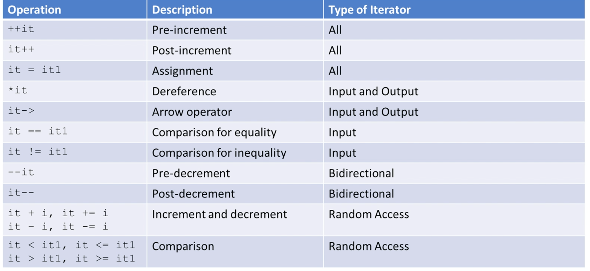

# Iterators

*Iterators* are used for working upon a sequence of elements from [[containers]], e.g. forward, reverse, by value, by reference, constant, etc. *Iterators* work like *pointers* by design, most of the container classes can be traversed with iterators.

1. Iterators must be declared based on the container type that they will iterate over
2. Iterator `.begin()` method points to the **first element**
3. Iterator `.end()` method points to the location **after the last element**



```c++
std::vector<int> vec {1,2,3};
std::vector<int>::iterator it1 = vec.begin();           // declare with container type
for (auto it2 = vec.begin(); it != vec.end(); ++it) {   // declare with auto
    std::cout << *it << " ";
}
std::advance(it1, 2);   // move iterator to the right, or negative value to move to the left
std::prev(it1);         // return iterator before it1
std::next(it1);         // return iterator after it1

/* Inserter */
std::deque<int> dq {5,6,7,10,11,12};
std::vector<int> v {1,2,3,4,5,6,7,8,9,10,11,12,13,14,15};
std::copy(std::find(v.begin(), v.end(), 13),
            v.end(),
            std::back_inserter(dq)); // 5,6,7,10,11,12,13,14,15
std::copy(std::find(v.begin(), v.end(), 8),
            std::find(v.begin(), v.end(), 10),
            std::inserter(dq, std::find(dq.begin(), dq.end(), 10))); // 5,6,7,8,9,10,11,...,15
std::copy(v.rbegin() + 11,
            v.rend(),
            std::front_inserter(dq)); // 1,2,3,4,5,6,...,15

/* Stream Iterators */
std::istream_iterator<int> myIntStreamReader(std::cin);
std::ostream_iterator<int>(std::cout, ":");
```

#### Other iterators

- `const_iterator`: cannot change the values that iterators point to
- `reverse_iterator`: reverse the direction of a regular iterator
- `const_reverse_iterator`

#### Iterator invalidation

Iterator is like a raw pointer that could be invalidated, pointing to junk data. In the following code, no compiler error and no warning will be reported. Developer should watch for such errors and prevent them, e.g. `insert()`, `erase()`, `resize()`.

```c++
for (auto it = map.begin(); it != map.end(); ++it) {
    map.erase(it->first); // map has been restructured and iterator still thinks itself is healthy
}
```
