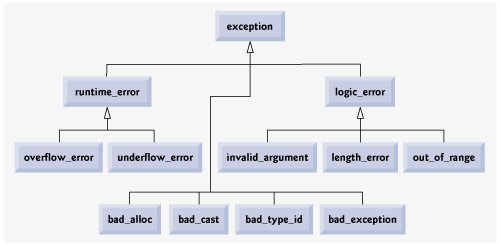

# Exception Handling

## Basic concepts

Exception handling indicates the extraordinary situation has been detected or occurred, and program can deal with the situation in a user-defined manner. Examples are insufficient resources, invalid operators, range violations, underflows/overflows, illegal data, etc.

- Exception: an object signals an error has occurred
- Throw/Raise an exception: the place where the error occurred don't know how to handle it, code throw an exception describing the error to another part of code that knows how to handle the error
- Catch/Handle an exception: code handles the error, may or may not terminate the program

## Syntax

- `throw`
    * throws an exception, followed by an argument

- `try { code_that_may_throw_an_exception }`
    * contains the code to run that may throw an exception
    * once the code throws an exception, `try` block exits
    * the thrown exception is handled by a `catch` handler, if no catch handler defined, the program terminates

- `catch (Exceptoin ex) { exception_handling_code }`
    * contains the code to handle the exception
    * can have multiple `catch` handlers
    * may or may not cause the program to terminate

```c++
try {
    if (total == 0)             // try block
        throw 0;                // throw the exception, exit the try block
    average = sum / total;      // won't execute if total==0
}
catch (int &ex) {               // exception handler
    std::cerr << "Can't divide by zero!" << std::endl;
}
// program continues...
```

#### Catch up multiple exceptions

Different `throw` data types will be handled by different `catch` handlers. `catch (...)` takes care of all types of thrown data if they don't have specific handlers for their types.

```c++
double div_func(int sum, int total) {
    if (total == 0)
        throw 0;
    if (sum < 0 || total < 0)
        throw std::string{"Negative value error"};
    return static_cast<double>(sum)/total;
}
try {
    average = div_func(sum, total);
}
catch (int &ex) {
    std::cerr << "Can't divide by zero!" << std::endl;
}
catch (std::string &ex) {
    std::cerr << ex << std::endl;
}
catch (...) {
    std::cerr << "Unknown exception!" << std::endl;
}
```

#### Catch handlers while stack unwinding

- If an exception is thrown but not caught in the current function scope, C++ tries to find a `catch` handler by unwinding the stack
    1. terminate the function at the `throw` line, remove the function from the call stack
    2. if a `try` block is used, then `catch` block is checked for a match
    3. if no `try` block is used, or if the `catch` handler doesn't match, stack unwinding occurs again
    4. if no `catch` handler when unwinding back to the `main`, the program terminates

#### User-defined exceptions

```c++
class DivideByZeroException {
};
catch (const DivideByZeroException &ex) {
}
```

#### Class-level exceptions

Exceptions can be thrown from within a class, too.

- From methods
    * work the same way as they do for functions mentioned above

- From constructor
    * throw an exception if the object cannot be initiailized

- From destructor
    * DO NOT throw exception from the destructor - undefined behavior

```c++
/* IllegalBalanceException.h */
class IllegalBalanceException {
public:
    IllegalBalanceException() = default;
    ~IllegalBalanceException() = default;
};
/* Account.cpp */
Account::Account(std::string name, double balance)
    : name{name}, balance{balance} {
    if (balance < 0.0)
        throw IllegalBalanceException{};
}
/* main.cpp */
try {
    std::unique_ptr<Account> jim_account = std::make_unique<Chequeing_Account>("Jim", -10.0);
}
catch (const IllegalBalanceException &ex) {
    std::cerr << "Can't create an account from a negative balance!" << std::endl;
}
```

## Exception class hierarchy

The C++ standard library exception class hierarchy.



```c++
/* IllegalBalanceException.h */
class IllegalBalanceException : public std::exception {
public:
    IllegalBalanceException() noexcept = default;
    ~IllegalBalanceException() = default;
    virtual const char* what() const noexcept {
        return "Illegal balance exception";
    }
};
/* Account.cpp is the same as class-level exception example mentioned above */
...
/* main.cpp */
try { ... } // same as class-level exception example mentioned above
catch (const IllegalBalanceException &ex) {
    std::cerr << ex.what() << std::endl;
}
```