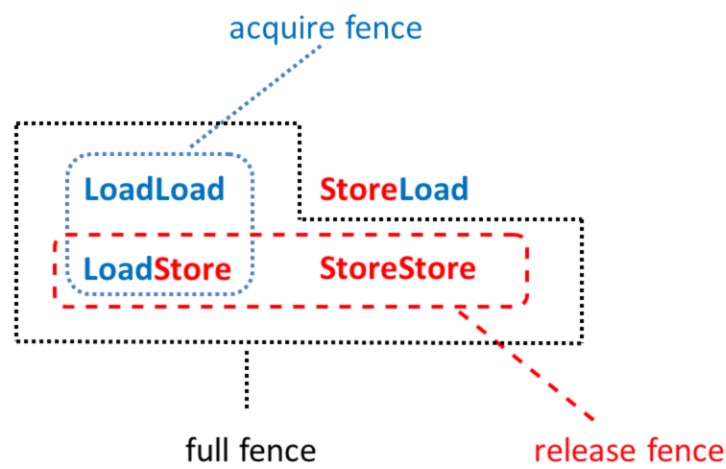

# Fences as Memory Barriers

`std::atomic_thread_fence` prevents specific operations from crossing a fence (memory barrier). The fence placed between two operations not reordered, like
+ *load-load*
+ *load-store*
+ *store-load*
+ *store-store*

> Reordering is always present if **non-atomics** or **atomic operations with relaxed semantic** are used.

+ Full fence
	+ `std::atomic_thread_fence()` or `std::atomic_thread_fence(std::memory_order_acq_rel)`
	+ only *store-load* can be ordered
+ Acquire fence
	+ `std::atomic_thread_fence(std::memory_order_acquire)`
	+ a read/load operation (before the fence) won't be reordered by a read/load or write/store operation (after the fence)
+ Release fence
	+ `std::atomic_thread_fence(std::memory_order_release)`
	+ a read/load or write/store operation (before the fence) won't be reordered by a write/store operation (after the fence)



## Fences vs. Atomics

1. Fences don't need [atomic](atomics.md) variables
2. Fences are more heavyweight

```c++
atomic<string*> ptr;
int data;
atomic<int> atoData;

// atomic-based
void producer(){
    string* p  = new string("C++11");
    data = 2011;
    atoData.store(2014, memory_order_relaxed);
    ptr.store(p, memory_order_release);
}
// fence-based
void producer(){
    string* p  = new string("C++11");
    data = 2011;
    atoData.store(2014, memory_order_relaxed);
    atomic_thread_fence(memory_order_release); // <-
    ptr.store(p, memory_order_relaxed); // <-
}

// atomic-based
void consumer(){
    string* p2;
    while (!(p2 = ptr.load(memory_order_acquire)));
    cout << "*p2: " << *p2 << endl;
    cout << "data: " << data << endl;
    cout << "atoData: " << atoData.load(memory_order_relaxed) << endl;
}
// fence-based
void consumer(){
    string* p2;
    while (!(p2 = ptr.load(memory_order_relaxed))); // <-
    atomic_thread_fence(memory_order_acquire); // <-
    cout << "*p2: " << *p2 << endl;
    cout << "data: " << data << endl;
    cout << "atoData: " << atoData.load(memory_order_relaxed) << endl;
}

int main(){
    thread t1(producer);
    thread t2(consumer);
    t1.join();
    t2.join();
}
```
