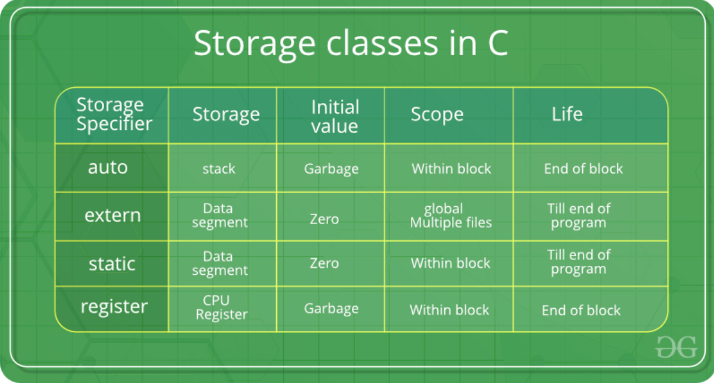

# C Language Questions

## 1. Keywords / Attributes

### What is `volatile` keyword?

A qualifier that tells the compiler **not to optimize** a variable which value may change anytime outside the scope of the program. CPU will not cache its value in registers but to fetch it from the main memory or hardware every time.

It's useful for memory-mapped peripheral registers, global variables modified by an ISR, global variables accessed by multiple threads.

### What is `const`?

#### `#define` vs. `const`, e.g. compilation, security, memory usage?

+ `#define PI 3.14`
  + textual substitution during the preprocessing, before compilation
  + compilation: no type-checking
  + security: lack of type safety, may lead to unexpected behavior
  + memory: no memory consumed at runtime

+ `const int value = 10`
  + inform the compiler that the value of the variable can't be modified after initialization
  + compilation: type-checking
  + security: has type safety
  + memory: need space

#### Can a variable be both `const` and `volatile`?

Yes. `const` makes sure the value of the variable can't be changed inside the scope of the program. But its value can still be modified by outside intervention.

#### What is a constant pointer?

+ `const int* ptr1`: pointer to a constant
+ `int* const ptr2`: a constant pointer
+ `const int* const ptr3`: a constant pointer to a constant

Detailed notes [pointers](../pointers/README.md).

### What is `static` keyword?

A `static` variable in a local function: its value is kept between calls to that function.

A `static` global variable in a file: the scope of that variable is within the file.

A `static` function in a file: the scope of that function is localized to that file.

#### Difference of `static` in C and C++

See C++ Question note [Keywords Section](cpp.md).

#### Can `static` variable be declared in a header file?

Not a good idea, because each file includes that header will have a private copy of that variable.

### What is `auto` keyword?

It declares a local variable whose scope remains within the block of code. It's the default storage class for all variables declared inside a function or a block.

### What is `register` keyword?

It hints to compiler that a given variable can be put in a register. Registers are faster than memory access so the variable which is most frequently used in a program can be declared with `register`. However, it's compiler's choise to put it in a register or not.

### What is `extern` keyword?

Used to declare a variable or function that is defined in another file, typically in a multi-file project.

+ only one file should **define** the variable
+ other files use `extern` to **declare** of using that variable

### Types of storage classes?

`auto`, `extern`, `static`, `register`.



### What is `inline` keyword? Compared to macro?

A suggestion (not guaranteed) to the compiler to substitute the body of the function in each call to that inline function by expanding its definition.
+ cons
	+ increases the code size and compilation time (function duplicated at each occurrence)
+ pros
	+ reduces the code execution because it skips the argument passing, value returning and stack changing procedures.

|  | `inline` | Macro |
|--|----------|---------|
| Argument type checking | still functions so argument types are checked by the compiler | No |
| Multiple lines | use `;` as normal | use trailing backslash `\` |
| Scope | have its own scope for variables and it can return a value | No |

### Compiler Attributes

#### `packed`

`packed` is non-standard, compiler-specific attribute to instruct compiler not introducing padding between struct/class members.

+ pros
  + save memory footprint
  + ensure the data structure compatibility
+ cons
  + slow the memory access
  + bad portability due to non-standard, compiler-specific

```c
struct foo { // sizeof(foo) == 9
  char a;
  int arr[2] __attribute__((packed));
}; // if not packed, size == 12

struct bar { // sizeof(bar) = 1 + 4 + 8 =13
  char a;
  int b;
  double c;
} __attribute__((packed));
// if not packed, size = 4 + 4 + 4*2 = 16
```


## 2. Data Structures

### Size of different data types?

sizeof(char) = 1 byte, sizeof(int) = 4 bytes, sizeof(short) = 2 bytes, sizeof(long) = 8 bytes, sizeof(float) = 4 bytes, sizeof(double) = 8 bytes.

Size of pointer is 8 bytes on 64-bit machine and 4 bytes on 32-bit machine.

#### Difference between `sizeof()` and `strlen()`

`sizeof()` is an operator, returning the size of any data type or variable during compile-time, not restricted to string.

`strlen()` is a function, returning the length of a string until a null-terminator `\0` at runtime.

### `struct` vs. `union`?

Conceptually they are the same, grouping differnt data types under one data type.

|  | `struct` | `union` |
|--|----------|---------|
| Memory | each item has its own storage and location | size is the largest member and memory allocated is shared by all items |
| Modification | items' values are independent | change the value of one time will alter others |
| Access | each inidvidual item can be accessed at a time | only one item can be accessed at a time |
| Initialization | several items can be initialized at once | only the 1st item can be initialized |

### What is padding?

Compiler adds padding to ensure proper memory alignment, hence improve the memory access performance.

### What is `enum`?

Used to assign names to integral constants, easy to read and maintain.

```c
enum week = {Mon, Tue, Wed, Thu, Fri, Sat, Sun};
enum week today;
today = Fri;
```

### List vs. Array?

|      | Array | List |
|------|-------|------|
| **Size** | Fixed during declaration | Dynamically grow or shrink during execution |
| **Allocation** | At compilation | At runtime |
| **Element Order** | Sequential memory blocks | Random |
| **Element Access** | Direct or random by using index | Sequential by traversing from head |
| **Element Insert/Delete** | Slow as shifting required | Easy and fast |
| **Search** | Binary search or linear search | Linear search |
| **Memory** | Less footprint but inefficient utilization | More footprint but efficient utilization |

When to use the linked list:

- need constant time insertion/deletion

- don't know the size of elements

- random access to element isn't required


## 3. Pointers

### What is a `NULL` pointer?

A NULL pointer means it doesn't point to any valid location.

### What is a `void` pointer?

It can point to a variable of any type. But to reference it, we must cast correct data type to the void pointer.

### What is a `volatile` pointer?

It means the pointer itself isn't volatile but points to a volatile variable.

### What is a wild pointer?

A pointer that isn't initialized (e.g. `int *p`) to any valid address or NULL.

### What is a dangling pointer?

If a memory region is de-allocated and freed, but its pointer is not assigned to NULL, which may still contain the address. Now accessing that pointer will cause a Segmentation fault.

### What is the `restrict` pointer?

Alias pointers refer to multiple pointers point to the same memory addresses. This makes compiler cannot optimize some code if a function takes in two pointers as arguments. For example, in the following code, compiler doesn't know if `a` and `b` are aliases so that it won't optimize the code, not returning "11" directly.

```c
int foo(int* a, int* b) {
    *a = 5;
    *b = 6;
    return (*a + *b);
}
```

The `restrict` keyword prevents the aliasing, which tells compiler in the current scope the pointers have no alias. Therefore, if we define `int foo(int* restrict a, int* restrict b)`, compiler will figure out "11" as the output during the optimization.

### What is double pointer?

Double pointer, a.k.a pointer to a pointer, is usually used to:
+ represent a dynamic 2D array
+ work with a function that needs to modify the value of a pointer

```c
int** arr = (int**)malloc(NUM_ROWS * sizeof(int*));
for (int i = 0; i < NUM_ROWS; ++i) {
  arr[i] = (int*)malloc(NUM_COLS * sizeof(int));
}
for (int i = 0; i < NUM_ROWS; ++i) {
  free(arr[i]);
}
free(arr);

void modifyPtr(int** ptr) {
  *ptr = (int*)malloc(sizeof(int)); // change the location that ptr pointers to
  **ptr = 10;
}
```

#### Risks of Using Double Pointer

+ additional level of indirection increases the complexity of code
  + prone to dereferencing error, nullptr dereferencing, etc.
  + lifetime management is tricky, especially passed to different functions
+ prone to memory leaks

### What is memory alignment?

A memory address is said to be aligned when the data referenced by said address is b bits long, and said address is b-bits aligned.
+ A pointer is **aligned** when it points on aligned memory
+ A pointer is **unaligned** when it points on unaligned memory

#### Can `memcmp` determine if two `struct` are equal?

No. `memcpmp` compares byte by byte. But `struct` may have padding for memory alignment. The data in the padding space is random that cannot be used for comparing.

### `++*ptr` vs. `*ptr++`

```c
++*ptr -> *ptr = *ptr + 1;
val = *ptr++; -> val = *ptr, ptr = ptr + 1;
```

### Complex pointer declarations

+ a pointer to a function that takes an `int*` as a parameter and return an `int*`
```c
int* func(int* a) {...}

int* (*pFunc)(int*) = &func;
int* x = pFunc(y);
```

+ an array of multiple pointers to functions that take an `int*` as a parameter and return an `int*`
```c
int* func1(int* a) {...}
int* func2(int* a) {...}

int* (*pFuncs[2])(int*) = {&func1, &func2};
int* x = pFuncs[0](y);
```


## 4. Interrupt

### Can a breakpoint be put in an ISR?

Not a good idea, it affects the hardware realtime behavior.


## 5. Build Program

### Preprocessor, compiler, assembler and linker?

Preprocessor: process and expand the preprocessor commands.

Compiler: generate assembly code from expanded source code.

Assembler: produce an assembly listing with offsets and generate object files.

Linker: combine object files or libraries to produce a single executable file.

### (TODO) Static linking vs. Dynamic linking?

+ Static
  + linker copies the dependencies into the final executable
  + pros
    + slightly better start-up performance
+ Dynamic
  + linker copies the name of external libraries into the final executable as unresolved symbols
  + actual linking of unresolved symbols at runtime
  + pros
    + smaller the final executable: less disk space and memory used
    + all executables shared the same single copy of library in the memory
    + permit easier versioning and update of library


## 6. Memory Management

### `malloc()` vs. `calloc()`?

Both allocate memory dynamically. But `malloc()` has one argument, the block size in bytes. `calloc()` has two arguments, number of blocks and block size in bytes, which also initializes the memory region to 0.

#### Difference between `malloc()` and C++ `new`

+ `malloc`
  + a function in C, allocating a block of memory on heap and returning the pointer
  + not type-safe, return `void*` which needs explicitly type cast
  + not guarantee to initialize the allocated memory
  + not overloaded
  + doesn't throw exception, simply return `NULL` if failed

+ `new`
  + an operator in C++, allocating memory on heap and constructing an object, then returning a pointer
  + type-safe, return pointer to specific data type
  + initialize according to the constructor and built-in data types, e.g. `int`
  + can be overloaded to customize the allocation process
  + throw `std::bad_alloc` exception if memory allocation fails

### Garbage collection in C?

Garbage collection is a memory management technique: allocation/deallocation of memory.
+ GC prevents following potential bugs
  + pros
    + dangling pointer that memory pointed is deallocated
    + deallocate a memory second time which has been deallocated or reallocated to other object
    + memory leaks
  + cons
    + extra CPU cycles to find unused memory and deallocate it
    + developer doesn't know when it is deallocated
  + algorithms
    + reference counting
    + mark & sweep
      + mark phase
        + traverse memory and mark all objects that are still reachable or in use as *live*
      + sweep phase
        + sweep through the entire memory, looking for unmarked objects
        + they are garbage and will be freed and made available for future allocations
+ C supports manual memory management
  + `malloc`/`free`
+ C++ now supports GC
  + `new`/`delete`
  + smart pointers

### How does `free()` know the memory to deallocate?

`malloc()` allocates a bit more memory than requested for storing the information of the allocated block. `free(ptr)` will use the pointer address to find that special information for deallocation. If passed in addresses other than that pointer, it will get garbage and the behavior is undefined.

#### What if double free()-ed?

Free the same dynamically allocated memory more than once. It may cause:
+ memory corruption
  + corrupt the memory management data structure
+ segmentation fault
  + access violation and crash
+ undefined behavior

#### What if forgetting to free()?

Memory leaks - the allocated memory remains reserved, program can't reuse that block of memory. A long-running program, like a daemon, will continue consume the memory and reduce the system performance or crash the system.


### Memory Layout of a C Program?

The memory layout or the process's virtual address space looks typically like this:


- Text/Code Segment

Placed below the heap and stack in case that heap/stack overflows. It contains executable instructions and usually read-only.

- Data Segment

1. DS (Initialized data)

Contains initialized **global** variables and local **static** variables. This segment can be further classified into read-only area (e.g. constant global variable) and read-write area.

2. BSS (Uninitialized data, Block Started by Symbol)

Any unitialized global variables and local static variables will be stored in the BSS. If assigned with `0` or `NULL`, they are still put in this segment.

- Stack

Stack is used to store function variables (main and user-defined functions), e.g. local variables, argument passed to function, return addresses. Stack is implemented by a LIFO structure, which top is tracked by a **stack pointer**. The set of values pushed for one function call is termed a **stack frame**. This is how recursive functions in C can work. 

- Heap

The dynamic memory allocation takes place in the heap, e.g. `malloc()`, `calloc()`, `realloc()`.


## Others

### What is concatenation operator `##`?

Used to concatenate two arguments, LITERALLY (not value).

```c
#define SOME_MACRO(a, b) a##b
int var = 15;
printf(“%d”, SOME_MACRO(v, ar)); // output "v"+"ar" = var = 15
```

### Why `++i` is faster than `i++`?

`++i` is a single machine instruction `INR` (INcRement). But `i++` requires other instructions to load `i` apart from `INR`.

### Difference between C and C++?

C is a procedural language; C++ is object oriented language.

C is a low level language; C++ is a middle level language.

C follows **top down** approach; C++ follows **bottom up** approach???

### What is linkage?

Linkage describes how identifier can or cannot refer to the same object within the same scope or in the different scopes.

Three types of linkages:

- External linkage: global, non-static variables/functions, `extern int a`
- Internal linkage: static variables/functions, `static int b`
- None linkage: local variables, `int c`

### What is intrinsic functions?

Functions are provided by the compiler or processor rather than by libraries or code written by developers.

+ more efficient because they are machine instructions
+ examples
	+ atomic memory operations, `fetch_and_add`, etc.
	+ bit operations
